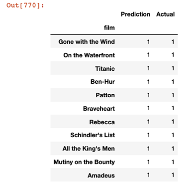
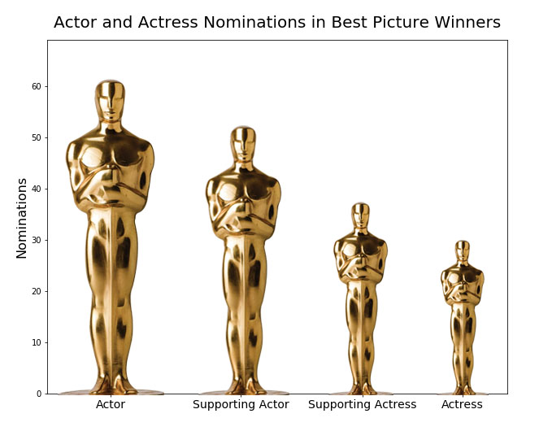
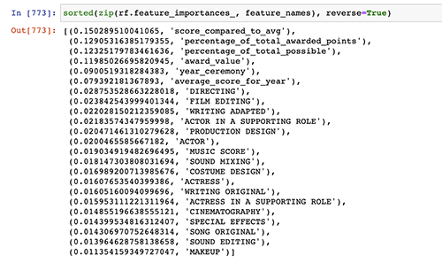
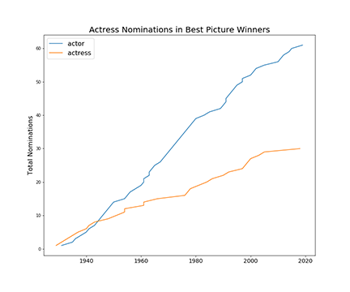

# Academy Awards - Machine Learning

## Description 

Using machine learning, I wanted to see if a model could be built to predict Best Picture winners by analyzing Oscar nomination patterns. There were some surprsing results that,  though beyond my initial scope, pushed me to explore further (one reason I love data is dicovering unexpected narratives).

## Table of Contents

* [Tools](#Tools)
* [Data](#Data)
* [Machine Learning](#Machine-Learning)
* [Results](#Results)
* [Graphs](#Graphs)
* [Contact](#Contact)

## Tools

Jupyter Notebook, Scikit-learn (machine learning), Matplotlib

## Data

Data set pulled from [Kaggle](https://https://www.kaggle.com/unanimad/the-oscar-award). 

This required substantial cleaning. Categories were added, removed, and names changed over time which made it hard to compare years, so I created fifteen basic category buckets. I removed the first five years from the data set as the award ceremony was a different beast in the beginning and it would complicate finding patterns in more recent years, which was my primary interest.

## Machine-Learning
Using a random forest test, my first model only analyzed the total number of nominations per film ('Best Director', 'Best Actress', 'Sound Mixing', etc), with the assumption that Best Picture winners tended to get more nominations overall. This resuled in a predictably poor performance: only correctly guess ing15% of the winners in my sample. 

From there, I started giving certain awards more weight to generate a score. For instance, 'Best Director' might count as 5 points, 'Special Effects' 2 points, etc. With this scoring system it was less about how many nominations a film received, but the type and combinations of awards.

This took some trial and error, running the test numerous times, but it wasn't random guessing either. I calculated percents for each category that revealed how often a Best Picture nominee was up for a certain award.

(If I wanted to take it further I could potentially add genre, rating, box office numbers, and time of year the film was released to my model -- but I was more interested in predicting based on as little knowledge as possible.)

## Results

With the above method, I brought my model up to a 45-55% success rate for guessing winner, and 95% success at guessing losing films.  (I was most concerned about the winner percentage, as you could predict that every film is a loser in a year and get four out of five right.)

This was much better than my first run, but it also shows the unpredictability of the Oscars. (2020 for instance, had a huge upset with foreign movie Parasite winning.)

However, my model revealed some surprising trends that, although not originally part of my scope, piqued my interest to pursue further.

## Graphs

Measuring the influence of each category in the model, a 'Best Actress' nomination is a suprisingly poor indicator for whether or not that film won Best Picture. In fact, a film that has a Supporting Actor nomination is a much better indicator.

It turns out, only a small ratio of Best Picture winners garnered Actress Nominations compared to Actor. Perhaps an optimistic, hopeful take on this would be that that trend is changing, but plotting the nominations on a line graph reveal that that gap is widening.

## Contact

Feel free to contact me with examples or any questions via the information below:

GitHub: [@julia-claira](https://api.github.com/users/julia-claira)

Email: julia-claira@gmail.com
